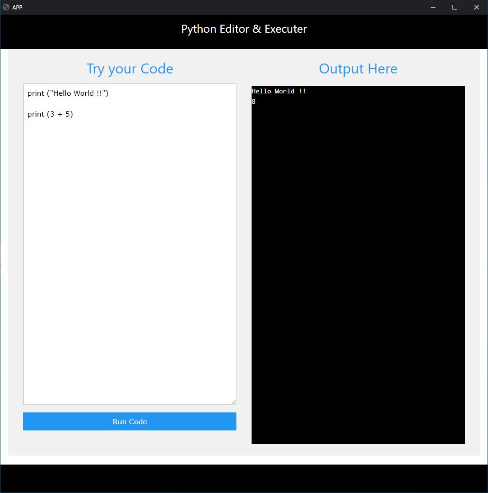

## EEl_PYTHON_PyExecuter-Compiler
This project is made with python and eel (https://pypi.org/project/Eel/) library.
This is just a demo of how we can build windows apps using python and web technologies.

#### This is windows application and to run it, please follow the instructions:
1. make sure python is installed on your pc. (get it from here --> https://www.python.org/downloads/ )
2. make sure eel is installed (get it from here --> https://pypi.org/project/Eel/ )
3. make sure chrome is installed (because i m using chrome to create an app)
4. clone the repo
5. open cmd in the script directory
6. type python app.py and press enter
7. it should open a chrome app window
8. type your code on left side and see the results on right side.

#### Known Issues :
1. Giving input to the entered program is not available.

#### Todo List:
1. Option to save scripts/programs. (by default-> script is saved as temp.py but need a more interactive way)
2. Option to load/select saved script.
3. Option to log the output into a log file.
4. Option to get input from user using a prompt box
